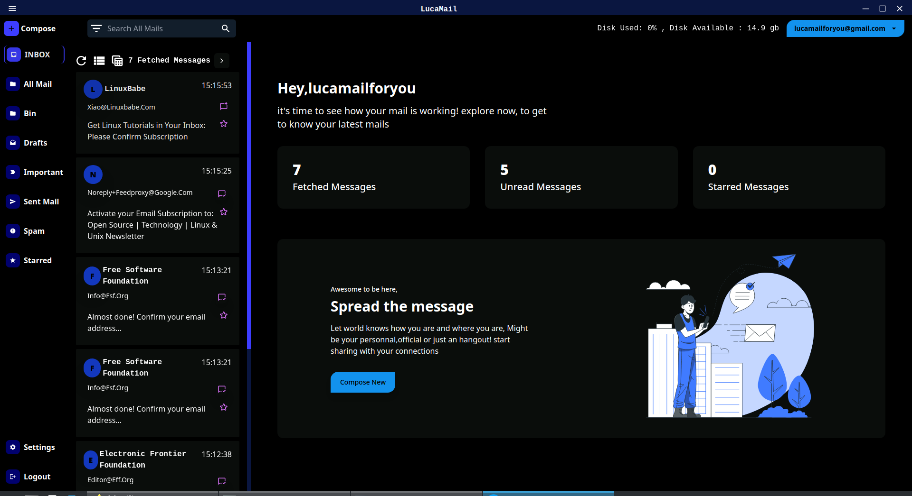
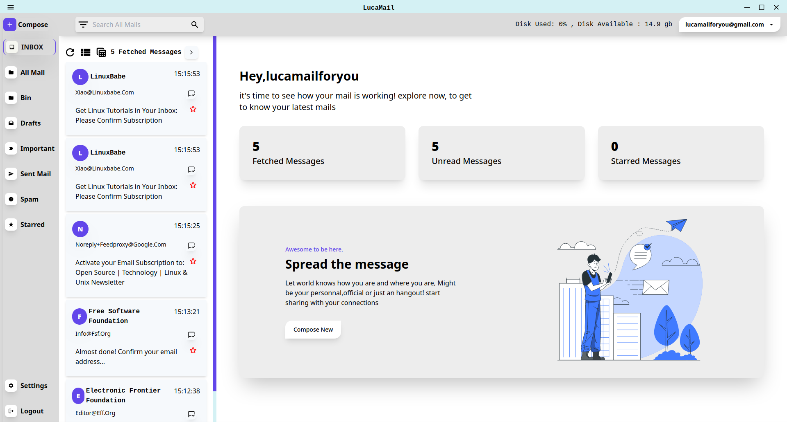

<br/>
<p align="center">
  <a href="https://raghavyuva.github.io/">
<h3 align="center"><br>LucaMail <i>v0.0.2-beta</i></h3>  </a>
  <p align="center">
    An Awesome Cross Platform Email Client!
    <br/>
    Note : This Project is Still in <strong>Beta</strong>  Version
    <br/>
    <br/>
    <br/>
    <a href="https://raghavyuva.github.io/">Website</a>
    .
    <a href="https://github.com/raghavyuva/LucaMail/issues">Report Bug</a>
    .
    <a href="https://github.com/raghavyuva/LucaMail/issues">Request Feature</a>
    .
    <a href="https://discord.gg/kG8a7mkvvw">Discord Group</a>
  </p>
</p>

# About The Project

 <p align="center"><a href="https://youtu.be/Nr4P234WgV0"></a></p>
 
LucaMail is an Open Source, Cross-Platform Email Client. LucaMail is developed to provide a cross-platform alternative to Email Clients that already exists. LucaMail focuses on contemporary technologies as well as maintaining a user-friendly UI. There exist Email Clients which lack providing cross-platform software, smooth UI, modern design techniques, and trending technologies. Whereas a solution *LucaMail* provides all such features. LucaMail is bundled with 2 classic dark and light themes along with a customized theme. LucaMail is lightweight, simple, OS friendly too.
LucaMail provides a Rich Text Editing Experience to send Mail. Only the `IMAP protocol` is supported in the beta version as many users don't seem to be using a POP protocol. LucaMail stores the messages as files under the user's home directory moved by the `luca` directory.
<br/>
<br/>
Some features may be lacking as it is a beta version but the bundled features are assumed to work in all perspectives as long as a bug is detected. So feel free to propose changes by opening a new issue, or if you want to implement your own, feel free to fork this repo and create a pull request. You can visit [Contributing Guide »](docs/contributing.md) for contribution aid. 

# Features
- Super Fast
- Light Weight
- Cross Platform Email Client that Supports Windows, MacOS, Linux 
- Specially Built as Desktop Application
- Multiple Ways to Install the Application
- New UI Design Systems 
- Multiple User Accounts Switch
- User Customized Themes ([See how to customize theme](docs/themecustomize.md))
- 2 Classical Themes: Dark and White
- Multiple Layout of Views Such as Grid View, and List View
- A Better Card View and a Table View
- Rich Text Editing Experience to Send Mail
- General Settings to Configure App Specs
- Available in Five Different Languages (Localisation)
- Download or Export Mail as CSV File

# Built With

Whilst I am the main developer of this project, this project couldn't of even started without the help of these open source projects, special thanks to:

- [ElectronJs](https://www.electronjs.org/)
- [ReactJS](https://reactjs.org/)
- [ImapFlow](https://imapflow.com/)
- [NodeMailer](https://nodemailer.com/about/)

# Installation

LucaMail can be installed in two ways:

- Releases

  Head on to [Releases](https://github.com/raghavyuva/LucaMail/releases/latest) and find out the Suitable binary for your OS. and set executable permissions and run it.

  ```sh
  wget https://github.com/raghavyuva/LucaMail/releases/latest/download/LucaMail-0.0.1-beta.AppImage
  chmod u+x LucaMail-0.0.1-beta.AppImage
  ./LucaMail-0.0.1-beta.AppImage
  ```

- Build From Source

  LucaMail can be built by it's code.

  ```sh
  git clone https://github.com/raghavyuva/LucaMail.git
  npm install --save
  npm run build
  cd release && ./LucaMail-0.0.1-beta.AppImage
  ```

# Preview




<p  align="center">
<a href="docs/preview.md" color="blue">More Screen Shots »</a>
</p>


# License

Distributed under the GPL-3.0 License. See [LICENSE](https://github.com/raghavyuva/LucaMail/blob/master/LICENSE) for more information.  
[](https://github.com/raghavyuva/LucaMail/blob/master/LICENSE)

# Author

- **Raghavyuva** - _Comp Sci Student_ - [Raghavyuva](https://raghavyuva.com/) - _All Work_

[](https://raghavyuva.com/)
[](https://www.linkedin.com/in/raghavyuva)
[](https://twitter.com/yuva_raghav)

# Donate

If you find this project as useful then do donate so that the project is maintained up-to date.
use this platform for donation.

<a href='https://ko-fi.com/raghavyuva' target='_blank'>
